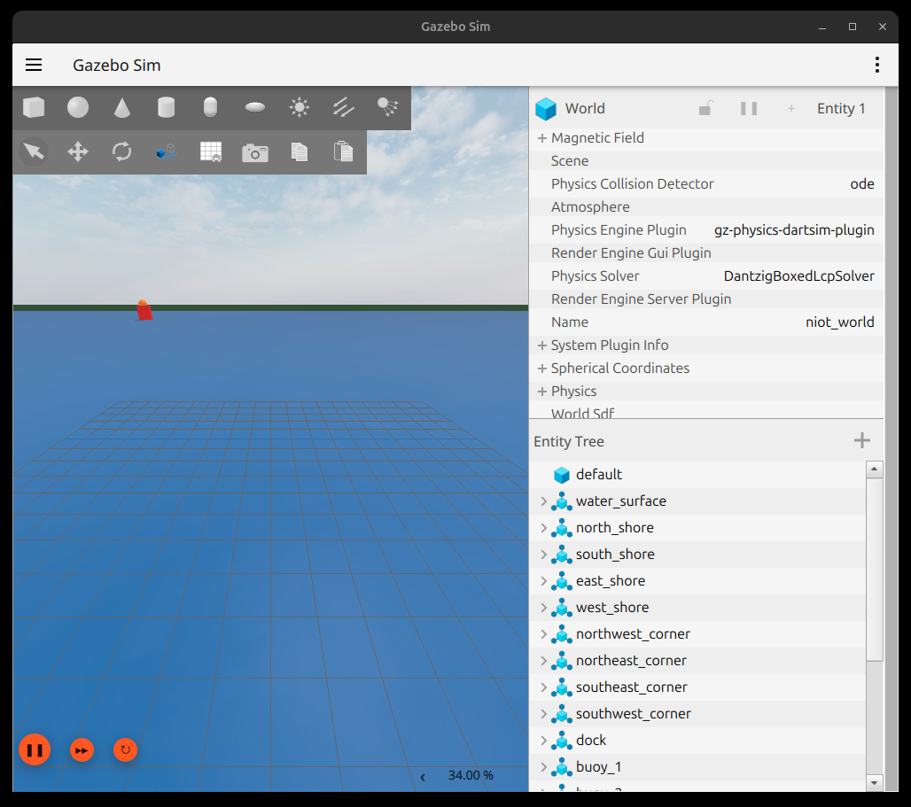
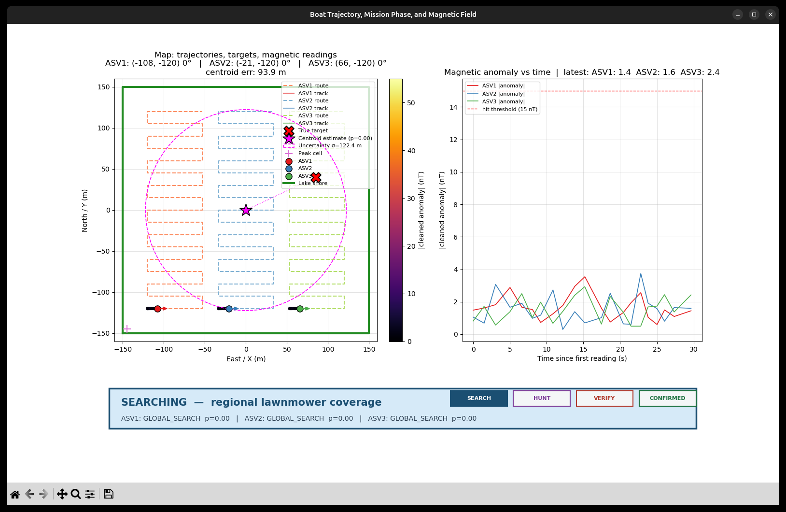
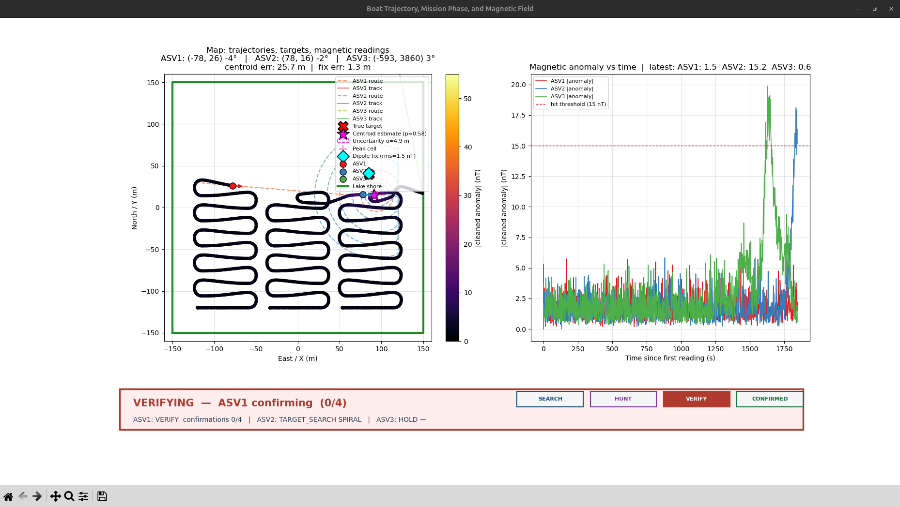

# Preliminary Design Report (PDR)
## NIOT Student Autonomous Vehicle Competition  
*(Official section order · 5–10 pages · Submit PDF only)*

---

# 1. Title Page

**Project Title:** Cooperative Multi-ASV Magnetic Anomaly Search and Localization using ROS 2 and Gazebo

| Field | Fill before submission |
|-------|------------------------|
| **Team Registration ID** | `[TEAM_REGISTRATION_ID]` |
| **Institute Name** | `[INSTITUTE_NAME]` |
| **Student Name(s)** | `[STUDENT_NAME_1]`, `[STUDENT_NAME_2]`, `[STUDENT_NAME_3]` |
| **Faculty Mentor Name** | `[FACULTY_MENTOR_NAME]` |

Submitted through the educational institution as per NIOT guidelines.

---

# 2. Abstract

This Preliminary Design Report proposes a **cooperative multi-Autonomous Surface Vehicle (ASV)** system for detecting and localizing a compact magnetic anomaly in a bounded water body. The objectives are: (i) partitioned survey coverage with three differential-thrust boats, (ii) online Bayesian fusion of cleaned magnetometer anomalies, (iii) information-driven hunt and densifying spiral, and (iv) peer verification before mission completion. The methodology combines Gazebo Harmonic 3D simulation, ROS 2 Jazzy autonomy nodes, strip lawnmower path planning, soft-dipole likelihood Bayesian updates, mutual information waypoint selection, line-of-sight guidance, and a declare/request verify handshake. Expected outcomes include a completed simulated Phase-4 mission with peer confirmation (4/4) and metre-class dipole-fit error against a planted evaluation target (85, 40) m, establishing a clear path from PDR to Phase I development under NIOT.

---

# 3. Introduction

### Background
Ocean and inland magnetic surveys support anomaly detection and harbour/environmental characterization. Autonomous platforms enable persistent coverage. This entry uses ROS 2 and Gazebo Harmonic as a digital twin for a three-ASV magnetic search stack (`version_3`).

### Problem statement
Locate an unknown compact magnetic dipole-like anomaly inside a bounded lake using craft that **do not** receive true target coordinates. Vehicles must survey cooperatively, fuse weak anomalies (~tens of nT) atop Earth’s field (~45,000 nT) and noise, then confirm a candidate before success.

### Objectives and scope
- Multi-ASV cooperative search with shared belief and peer verification  
- Theoretical models (dipole, Bayes, information gain, guidance)  
- 3D Gazebo demonstration with operator console  
- Preliminary simulation results and localization error metrics  
- **Scope:** simulation-validated PDR concept; real magnetometer hardware is Phase I  

---

# 4. Literature Review

Mobile magnetic anomaly detection typically uses dipole forward models and nonlinear least-squares inversion [Levenberg, 1944]. ASVs commonly use lawnmower coverage. Informative path planning via expected entropy reduction follows Shannon (1948). LOS guidance is standard for underactuated marine vehicles [Fossen, 2011]. Multi-robot search motivates separating discovery from confirmation.

ROS 2 and Gazebo enable reproducible marine robotics prototyping. Few competition-oriented packages combine strip deconfliction, online Bayesian magnetic fusion, MI hunt, shore-safe densification, and peer verify in one stack.

**Research gap / motivation:** Need an integrated, institutionally reproducible ASV magnetic search pipeline with math + simulation evidence for NIOT PDR evaluation.

---

# 5. Theoretical Design

### Overall system architecture
```
Gazebo plant (3 ASVs, lake, shores)
   | ros_gz_bridge
   v
Per-boat /asvN: sensing → mission_manager → LOS → thrust_mixer
Shared /swarm: bayes_fusion, verify_coordinator
```

### Mechanical design
Differential-thrust twin-propeller ASVs (`simple_boat{,_2,_3}`) with meshes, collision, and buoyancy in `niot_world` bounded by shore walls.

### Electrical / electronic systems (sim abstraction)
Thruster Float64 commands bridged to Gazebo; IMU/GPS/odom plugins for state. Hull power/wiring are Phase I.

### Sensors and actuators
| Element | Role |
|---------|------|
| Magnetometer | Anomaly feature |
| IMU / GPS / odom | Pose for map + LOS |
| Twin propellers | Surge/yaw (differential thrust) |

### Control strategy
\[
\psi_{\mathrm{LOS}}=\psi_{\mathrm{path}}+\operatorname{atan2}(-e_\perp,15\,\mathrm{m})
\]
Yaw PID; surge \(u_{\mathrm{ref}}=0.35\,\mathrm{m/s}\). HOLD = empty plan → zero cmd.

### Software architecture
Packages: `boat_bringup`, `boat_description`, `boat_msgs`, `boat_control`, `boat_sensing`, `boat_mapping`, `boat_mission`, `boat_navigation`.  
FSM: `GLOBAL_SEARCH` → `TARGET_SEARCH` (INFO_GAIN / SPIRAL) → `HOLD` → `VERIFY` → `COMPLETE`.

### Design methodology, calculations, expected performance
- **Coverage:** strips, gap 20 m, spacing 15 m, box ±120 m  
- **Dipole:** \(a=A/(r^3+s^3)\), \(A=4\times10^5\), \(s=20\) → 50 nT overhead  
- **Bayes:** HIT if cleaned anomaly ≥ 15 nT; \(b_k \leftarrow b_k P_{\mathrm{det}}(d_k)\)  
- **Hunt:** maximize MI; inland spiral \(r\le\min(80,\mathrm{room}-10)\)  
- **Verify:** peer orbit; 4 confirms (site ≤30 m, peak ≤50 m, anomaly ≥15 nT, \(p^\*\ge0.30\))  
- **Expected:** COMPLETE + metre-class \(e_{\mathrm{fix}}\) (stretch < 5 m)

---

# 6. Experimental Results

### Preliminary simulations
Launch: `ros2 launch boat_bringup multi_asv_phase4.launch.py` (`num_asvs:=3`). Planted eval target (85, 40) m.

  
*Fig. 1 — Gazebo 3D lake / ASV plant (`niot_world`).*

  
*Fig. 2 — SEARCH console: three strip routes, `GLOBAL_SEARCH`.*

  
*Fig. 3 — Hunt/VERIFY console: anomaly above 15 nT threshold.*

### Results and discussion

| Item | Value |
|------|-------|
| Outcome | `MISSION_COMPLETE` |
| Verifier / confirms | ASV1 / **4 of 4** |
| Declared candidate | (95.0, 15.0) by ASV3, \(p\approx0.956\) |
| Planted truth | (85.0, 40.0) |
| Best \(e_{\mathrm{fix}}\) | **≈ 0.0 m** (RMS ≈ 1.4 nT) |
| Median \(e_{\mathrm{fix}}\) (last 50) | ≈ 5.8 m |

COMPLETE validates the discover–verify protocol; densified sampling yields metre-class agreement with the planted dipole. Early SEARCH centroid error (~90 m) is expected pre-HIT.

---

# 7. Acknowledgements

Thanks to `[INSTITUTE_NAME]` for affiliation and computing facilities; Faculty Mentor `[FACULTY_MENTOR_NAME]` for guidance; and the ROS 2 / Gazebo open-source communities. Funding (if any): `[FUNDING_AGENCY_IF_ANY]`.

---

# 8. References

1. Open Robotics, “ROS 2 Jazzy documentation,” https://docs.ros.org/en/jazzy/  
2. Open Robotics, “Gazebo Sim Harmonic,” https://gazebosim.org/  
3. C. E. Shannon, “A mathematical theory of communication,” *Bell Syst. Tech. J.*, 1948.  
4. K. Levenberg, “A method for the solution of certain non-linear problems in least squares,” *Q. Appl. Math.*, 1944.  
5. T. I. Fossen, *Handbook of Marine Craft Hydrodynamics and Motion Control*. Wiley, 2011.  
6. Marine magnetic / UXO dipole survey literature (expand from institutional library for camera-ready).

---

## How to get the PDF (required by NIOT)

1. Upload **`docs/pdr_overleaf.zip`** to Overleaf (New Project → Upload).  
2. Set main file `main.tex` · Compiler **pdfLaTeX** · Recompile.  
3. Fill all `[PLACEHOLDERS]` in the title page / acknowledgements.  
4. Download **PDF only** and submit via your institute.

Target length: **5–10 pages**.
